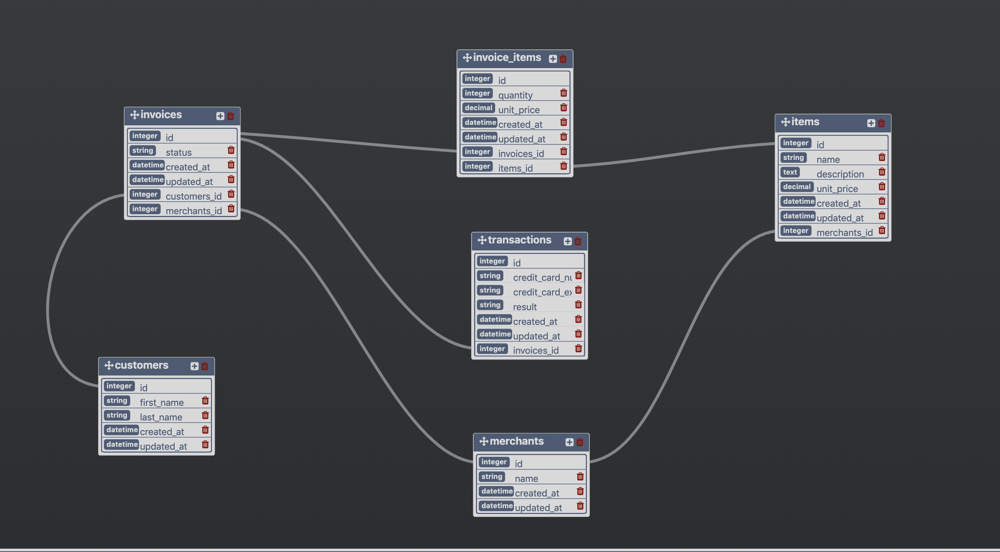

# Rails Engine

Rails Engine is a JSON API built in Ruby on Rails to expose sales data. It exposes data through record endpoints, relationship endpoints, and business intelligence endpoints.

## Setup

Select desired directory and follow these commands:

```
git clone git@github.com:zacisaacson/rails_engine.git
cd rails_engine
bundle install
rake db:{create,migrate}
rake import_csv
rails server
navigate to http://localhost:3000 in browser
```
## Database

There are six types of resources with the following interactions:



## Endpoints

### Record Endpoints

- `GET /api/v1/resource` returns an index of all appropriate records.

- `GET /api/v1/resource/:id` returns a specific record that corresponds to the given ID.

- `GET /api/v1/find?parameters` returns the first record that matches the specified parameter.

- `GET /api/v1/find_all?parameters` returns all records that match the specified parameter(s). See below for the parameters available for each resource.

- `GET /api/v1/random` returns a random record from that resource's table.

### Relationship Endpoints

Relationship endpoints expose date from associated resources.

#### Merchants

- `GET /api/v1/merchants/:id/items` returns a collection of items associated with that merchant.

- `GET /api/v1/merchants/:id/invoices` returns a collection of invoices associated with that merchant from their known orders.

#### Invoices

- `GET /api/v1/invoices/:id/transactions` returns a collection of associated transactions.

- `GET /api/v1/invoices/:id/invoice_items` returns a collection of associated invoice items.

- `GET /api/v1/invoices/:id/items` returns a collection of associated items.

- `GET /api/v1/invoices/:id/customer` returns the associated customer.

- `GET /api/v1/invoices/:id/merchant` returns the associated merchant.

#### Invoice Items

- `GET /api/v1/invoice_items/:id/invoice` returns the associated invoice.

- `GET /api/v1/invoice_items/:id/item` returns the associated item.

#### Items

- `GET /api/v1/items/:id/invoice_items` returns a collection of associated invoice items.

- `GET /api/v1/items/:id/merchant` returns the associated merchant.

#### Transactions

- `GET /api/v1/transactions/:id/invoice` returns the associated invoice.

#### Customers

- `GET /api/v1/customers/:id/invoices` returns a collection of associated invoices.

- `GET /api/v1/customers/:id/transactions` returns a collection of associated transactions.

### Business Intelligence Endpoints

Endpoints using advanced ActiveRecord and SQL.

#### All Merchants

- `GET /api/v1/merchants/most_revenue?quantity=x` returns the top x merchants ranked by total revenue.
